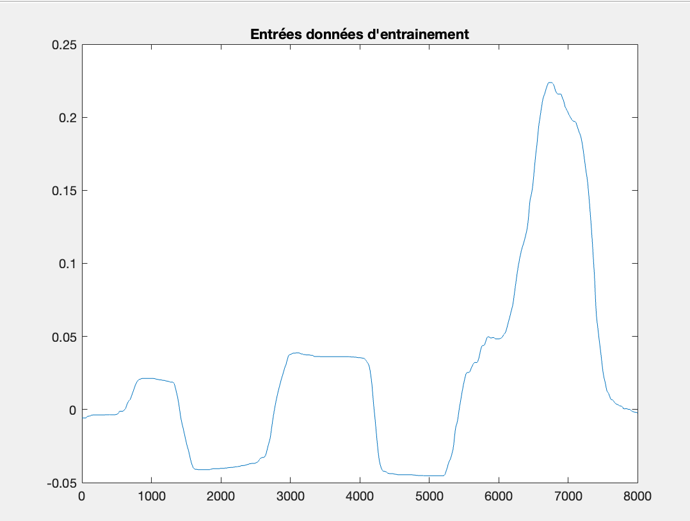
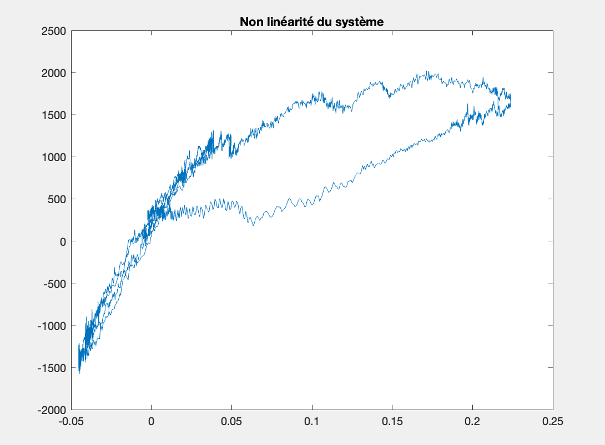
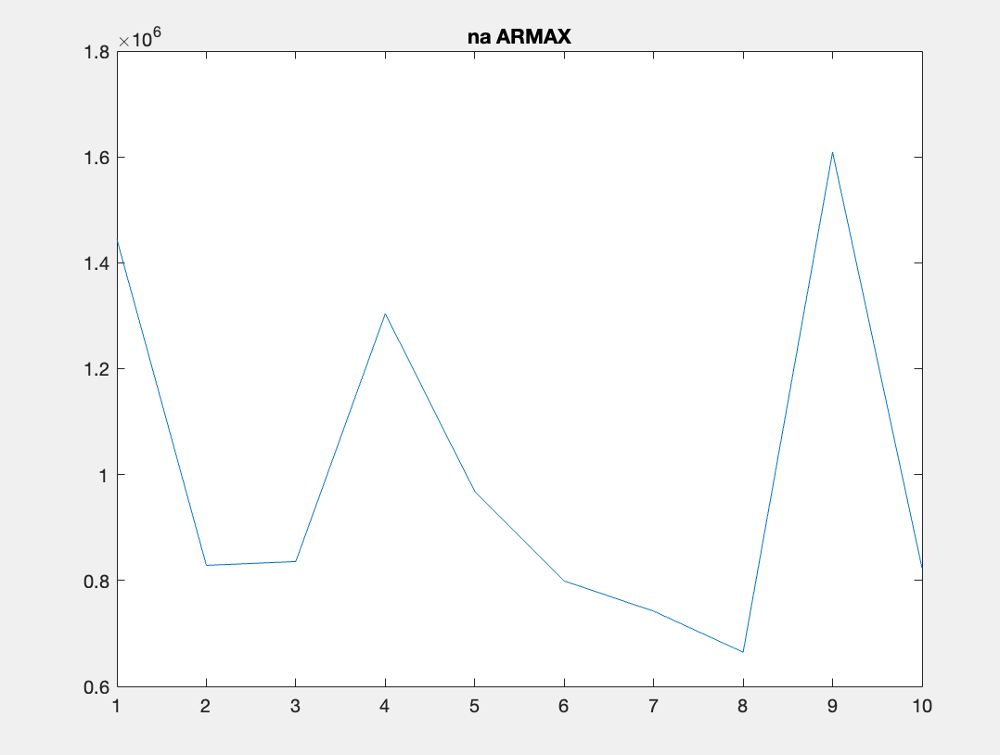
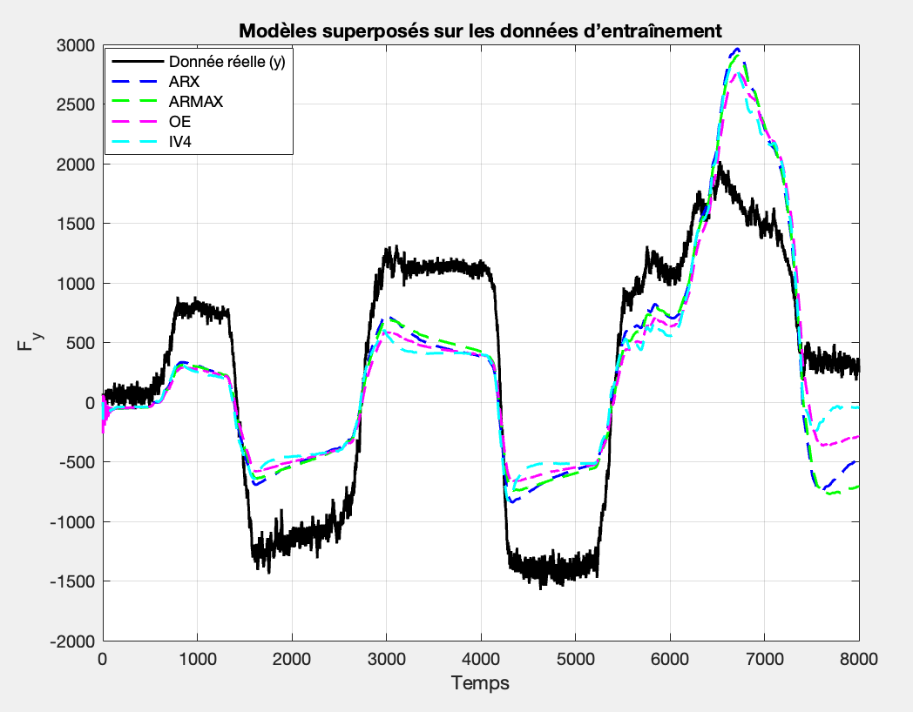
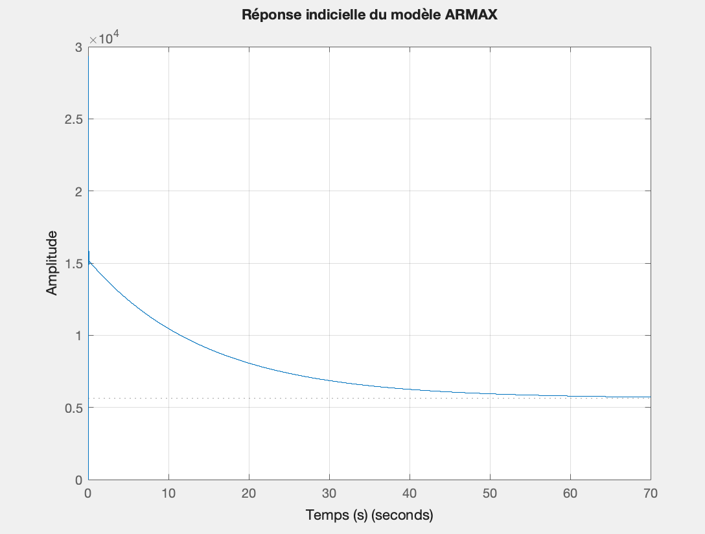
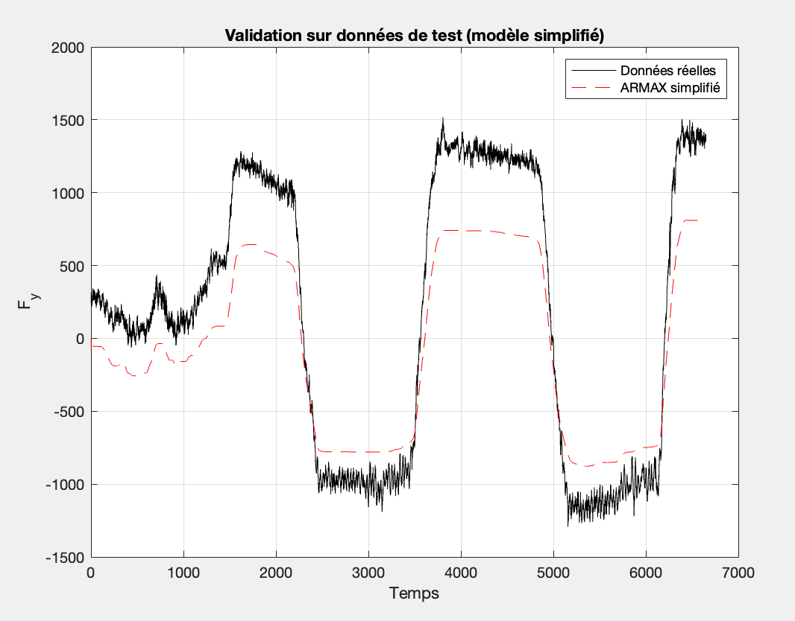

# Dynamic System Identification: Vehicle Lateral Force

**Spring 2025**

This repository contains the source code and documentation for a project on identifying the dynamic behavior of a vehicle. The goal is to determine a mathematical model (discrete transfer function) that relates the steering angle to the lateral force exerted on the vehicle using experimental data.


> *Experimental vehicle "DYNA" from the HEUDIASYC laboratory used for data collection.*

## Authors

* **Léopold Chappuis**
* **Alexandre Eberhardt** @alexandreeberhardt

## Project Objective

The system under study is characterized by:
* **Input ($u$)**: Steering angle of the wheels ($\delta$, in radians).
* **Output ($y$)**: Lateral force ($F_y$, in Newtons).

The objective is to identify the best parametric discrete model to predict the lateral force based on the steering angle, accounting for measurement noise and the inherent non-linearity of the physical system.

## Methodology

The identification process implemented in `main.m` follows these key steps:

### 1. Data Analysis

We analyzed the training datasets (`delta1`, `Fy1`) to assess signal quality.
* **Input**: Clean signal with no significant noise.
* **Output**: Noisy signal requiring a robust model.

 

A delay analysis (cross-correlation) determined a system delay of **$n_k = 1$ sample**. Additionally, an input-output plot revealed the **non-linear nature** of the system (hysteresis), suggesting that a linear model will be an approximation of the global trends.



### 2. Model Calibration (Hyperparameter Sweeping)

We evaluated four linear parametric model structures: **ARX**, **ARMAX**, **OE** (Output Error), and **IV4**.
A grid search approach was used to determine the optimal orders ($n_a, n_b, n_c, n_f$) by minimizing the Mean Squared Error (MSE).

*Example of parameter sweeping for ARMAX:*

> *The "elbow" in the error curve helps select the optimal order (e.g., $n_a=3$ for ARMAX).*

Selected parameters:
* **ARX**: $n_a=1, n_b=2$
* **ARMAX**: $n_a=3, n_b=2, n_c=3$
* **OE**: $n_b=2, n_f=4$
* **IV4**: $n_a=2, n_b=2$

### 3. Comparison and Selection

The models were trained on the first dataset and compared. While all models performed similarly, **ARMAX** provided the best balance between accuracy and robustness against noise.



### 4. Validation

The models were tested on a separate validation dataset (`delta2`, `Fy2`) to ensure they were not overfitting.


## Final Model: ARMAX

The selected ARMAX model has the following discrete transfer function ($T_s = 0.01s$):

$$G(z) = \frac{2.937 \times 10^4 z - 2.936 \times 10^4}{z^3 - 0.4435 z^2 - 0.1796 z - 0.3756}$$

* **Stability**: All poles are located inside the unit circle.
* **Static Gain**: $\approx 5631$ N/rad, which is physically consistent for this vehicle.

### Step Response


### Model Simplification
A pole-zero cancellation was performed to remove a slow mode ($z \approx 0.999$), reducing the model to a 2nd-order system without significant loss of accuracy.



## Usage

To run the analysis and reproduce the results:

1.  Open MATLAB.
2.  Ensure the **System Identification Toolbox** is installed.
3.  Navigate to the `model-identification/` directory.
4.  Run the main script:
    ```matlab
    main
    ```
5.  The script will generate the plots and output the model parameters in the command window.
